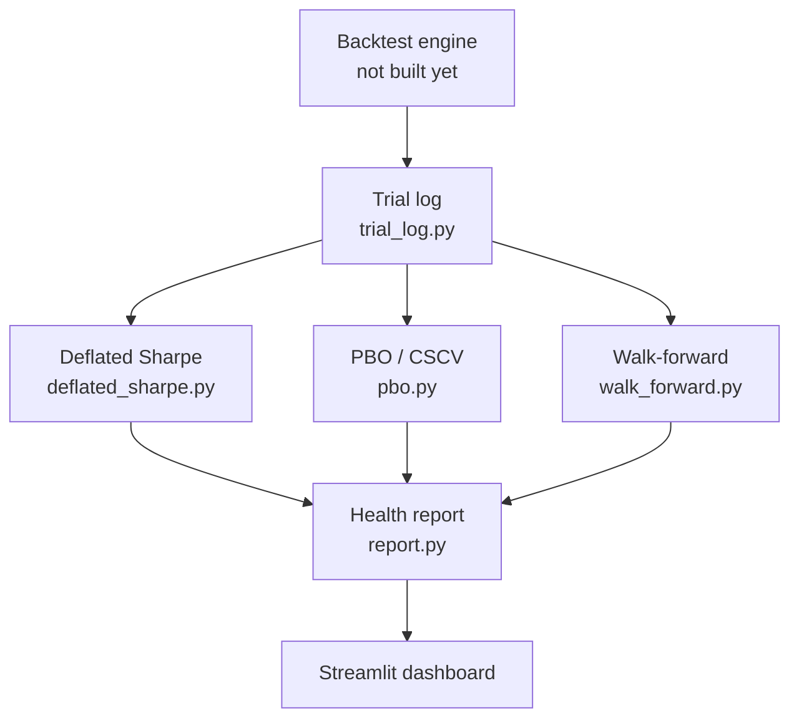

# Architecture

## 1. Pipeline overview



The backtest engine and dashboard are **outside** this module's scope. This
module's job is everything in between: log every run, grade it three
independent ways, and hand the dashboard one honest verdict.

## 2. Data contract

This is the interface the (future) backtest engine must produce, and the
interface every other module in this project reads from. Defined now, before
the engine exists, so the engine has to conform to this — not the reverse.

### `trials` — one row per backtest run

| Column | Type | Notes |
|---|---|---|
| `trial_id` | TEXT (PK) | unique ID per run |
| `created_at` | TIMESTAMP | when the trial was logged |
| `factors` | JSON | e.g. `["momentum", "value"]` |
| `params` | JSON | e.g. `{"lookback_months": 9, "rebalance": "monthly"}` |
| `start_date` / `end_date` | DATE | backtest window |
| `frequency` | TEXT | `"weekly"` |
| `risk_free_rate` | REAL | default `0.0` — explicit, not assumed silently |
| `sharpe_ratio` | REAL | |
| `annualized_return` | REAL | |
| `volatility` | REAL | annualized |
| `max_drawdown` | REAL | |
| `skewness` | REAL | of the weekly return series |
| `kurtosis` | REAL | of the weekly return series |
| `num_observations` | INTEGER | number of weekly returns |
| `tag` | TEXT (nullable) | e.g. `"round1_finalists"` — groups trials for PBO comparisons |

### `trial_returns` — one row per week per trial

| Column | Type | Notes |
|---|---|---|
| `trial_id` | TEXT (FK → trials.trial_id) | |
| `period_end_date` | DATE | week-ending date |
| `return_value` | REAL | **log return** for that week |

Primary key: `(trial_id, period_end_date)`.

**Why two tables, not one:** `trials` is the summary card DSR reads to grade
a single strategy. `trial_returns` is the raw time series PBO and
walk-forward need, because both methods work by chopping and recombining
actual return history — a summary stat isn't enough for either of them.

**Why log returns:** they sum cleanly across time periods and are the
assumption baked into the DSR and PBO papers' math. Simple (%) returns
would need extra compounding math to reconcile the two.

## 3. Module interfaces

### `trial_log.py`

```
log_trial(trial_metadata: dict, returns: pd.Series) -> str  # returns trial_id
get_all_trials(tag: str | None = None) -> pd.DataFrame
get_trial_returns(trial_id: str) -> pd.Series
get_returns_matrix(trial_ids: list[str]) -> pd.DataFrame  # wide format, for PBO
```

### `deflated_sharpe.py`

```
deflated_sharpe_ratio(
    returns: pd.Series,
    num_trials: int,
    trial_sharpes: list[float],
) -> dict
# {
#   "raw_sharpe":       SR   — observed Sharpe of the candidate
#   "expected_max_sr":  SR_0 — best Sharpe you'd expect from N skill-less trials
#   "sharpe_std_error": sigma_SR — uncertainty of SR, corrected for skew/kurtosis
#   "dsr":              Phi((SR - SR_0) / sigma_SR) — P(true Sharpe > 0)
#   "overfitting_gap":  SR - SR_0
#   "warnings":         list[str] — e.g. N=1, T<30
# }
```

Kurtosis convention: **non-excess** (normal = 3). See `deflated_sharpe.md`.

### `pbo.py`

```
compute_pbo(
    strategy_returns_matrix: pd.DataFrame,  # wide: dates x strategies
    num_partitions: int = 16,               # must be even
) -> dict
# {
#   "pbo":              fraction of splits where the IS winner is below OOS median
#   "lambdas":          list[float] — logit of relative OOS rank, one per split
#   "omegas":           list[float] — relative OOS rank in (0, 1), one per split
#   "num_combinations": C(S, S/2)
#   "warnings":         list[str] — e.g. fewer than 5 strategies
# }
```

### `walk_forward.py`

```
walk_forward_validate(
    returns: pd.Series,
    train_window: str,   # e.g. "3Y"
    test_window: str,    # e.g. "6M"
    step: str,            # e.g. "6M"
) -> dict
# {
#   "folds":        pd.DataFrame — one row per fold (see walk_forward.md)
#   "decay_ratio":  mean(OOS Sharpe) / mean(IS Sharpe), or None if IS Sharpe ~ 0
#   "num_folds":    int
#   "warnings":     list[str] — e.g. fewer than 4 folds ("insufficient history")
# }
```

Returned as a dict (not a tuple) so all four modules hand `report.py` the
same kind of object.

### `report.py`

```
generate_health_report(
    dsr_result: dict,
    pbo_result: dict,
    walk_forward_result: dict,
    thresholds: dict | None = None,  # configurable, see below
) -> dict  # JSON-serializable Health Report
```

## 4. Metrics & thresholds (configurable defaults, not hardcoded law)

| Metric | Green | Yellow | Red |
|---|---|---|---|
| PBO | < 0.20 | 0.20 – 0.40 | > 0.40 |
| DSR (prob. skill genuine) | > 0.95 | 0.50 – 0.95 | < 0.50 |
| Walk-forward decay ratio | > 0.70 | 0.40 – 0.70 | < 0.40 |

Decay ratio = average(out-of-sample Sharpe) ÷ average(in-sample Sharpe)
across all walk-forward folds.

These bands are conventions, not laws. DSR 0.95 is the usual "statistically
significant" line; DSR 0.50 means "coin flip or worse". They live in one
`DEFAULT_THRESHOLDS` dict in `report.py` and can be overridden per call.

## 4a. Data sufficiency

Working assumption: **5–10 years of weekly history** (~260–520 weeks).

| Check | Needs | Guard |
|---|---|---|
| DSR | T ≥ ~30 obs for skew/kurtosis to mean anything; N ≥ 2 trials | warning in result |
| PBO | ≥ 5 strategies; chunks of ≥ ~15 weeks (16 chunks on 260 weeks ≈ 16/chunk) | warning in result |
| Walk-forward | ≥ 4 folds for the decay ratio to be more than noise | warning in result |

Guards **warn, never silently pass**. `report.py` surfaces any warning as an
`"insufficient_history"` note on that metric so the dashboard can show it.

## 5. Design decisions log

| Decision | Choice | Reason |
|---|---|---|
| Return frequency | Weekly | Less noise/turnover than daily; standard in factor research |
| Return type | Log returns | Additive across time, matches DSR/PBO paper assumptions |
| Risk-free rate | 0%, stored explicitly per trial | Long-short is market-neutral; explicit beats silent |
| Trial grouping | Optional `tag` field | Not every logged trial belongs in the same PBO comparison |
| Storage | SQLite | Lightweight, file-based, migratable to Postgres later |
| Kurtosis in DSR | Non-excess (normal = 3) | Matches the paper's `sigma_SR` formula; mixing this up is the most common DSR bug |
| Module outputs | All dicts, all JSON-safe | One shape for `report.py` to consume; no tuples to remember the order of |
| Sufficiency guards | Warn, don't raise | Thin data should degrade the verdict, not crash the pipeline |
| Assumed history | 5–10 years weekly | Confirmed 2026-09-18; drives default window sizes |

## 6. Out of scope

- Factor construction logic (value/momentum/size/quality) — separate module
- Streamlit dashboard's visual design — only `report.py`'s data contract matters here
- Live/paper trading execution — this module is backtest-validation only
