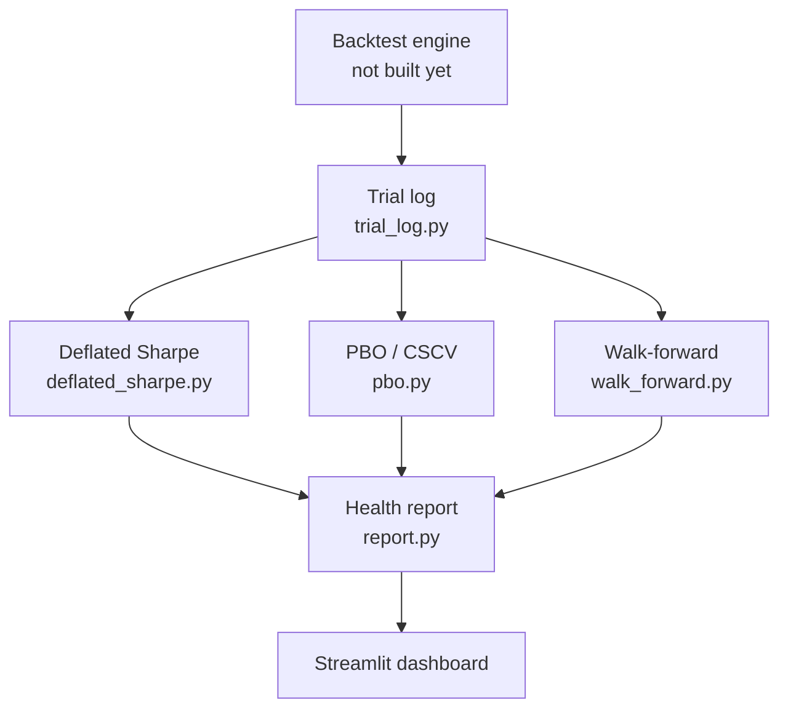

# Architecture

## 1. Pipeline overview



The backtest engine and dashboard are **outside** this module's scope. This
module's job is everything in between: log every run, grade it three
independent ways, and hand the dashboard one honest verdict.

## 2. Data contract

This is the interface the (future) backtest engine must produce, and the
interface every other module in this project reads from. Defined now, before
the engine exists, so the engine has to conform to this — not the reverse.

### `trials` — one row per backtest run

| Column | Type | Notes |
|---|---|---|
| `trial_id` | TEXT (PK) | unique ID per run |
| `created_at` | TIMESTAMP | when the trial was logged |
| `factors` | JSON | e.g. `["momentum", "value"]` |
| `params` | JSON | e.g. `{"lookback_months": 9, "rebalance": "monthly"}` |
| `start_date` / `end_date` | DATE | backtest window |
| `frequency` | TEXT | `"weekly"` |
| `risk_free_rate` | REAL | default `0.0` — explicit, not assumed silently |
| `sharpe_ratio` | REAL | |
| `annualized_return` | REAL | |
| `volatility` | REAL | annualized |
| `max_drawdown` | REAL | |
| `skewness` | REAL | of the weekly return series |
| `kurtosis` | REAL | of the weekly return series |
| `num_observations` | INTEGER | number of weekly returns |
| `tag` | TEXT (nullable) | e.g. `"round1_finalists"` — groups trials for PBO comparisons |

### `trial_returns` — one row per week per trial

| Column | Type | Notes |
|---|---|---|
| `trial_id` | TEXT (FK → trials.trial_id) | |
| `period_end_date` | DATE | week-ending date |
| `return_value` | REAL | **log return** for that week |

Primary key: `(trial_id, period_end_date)`.

**Why two tables, not one:** `trials` is the summary card DSR reads to grade
a single strategy. `trial_returns` is the raw time series PBO and
walk-forward need, because both methods work by chopping and recombining
actual return history — a summary stat isn't enough for either of them.

**Why log returns:** they sum cleanly across time periods and are the
assumption baked into the DSR and PBO papers' math. Simple (%) returns
would need extra compounding math to reconcile the two.

## 3. Module interfaces

### `trial_log.py`

```
log_trial(trial_metadata: dict, returns: pd.Series) -> str  # returns trial_id
get_all_trials(tag: str | None = None) -> pd.DataFrame
get_trial_returns(trial_id: str) -> pd.Series
get_returns_matrix(trial_ids: list[str]) -> pd.DataFrame  # wide format, for PBO
```

### `deflated_sharpe.py`

```
deflated_sharpe_ratio(
    returns: pd.Series,
    num_trials: int,
    trial_sharpes: list[float],
) -> dict  # {"raw_sharpe", "deflated_sharpe", "prob_skill_genuine"}
```

### `pbo.py`

```
compute_pbo(
    strategy_returns_matrix: pd.DataFrame,  # wide: dates x strategies
    num_partitions: int = 16,
) -> dict  # {"pbo", "rank_distribution"}
```

### `walk_forward.py`

```
walk_forward_validate(
    returns: pd.Series,
    train_window: str,   # e.g. "3Y"
    test_window: str,    # e.g. "6M"
    step: str,            # e.g. "6M"
) -> dict  # {"folds": pd.DataFrame, "decay_ratio": float}
```

### `report.py`

```
generate_health_report(
    dsr_result: dict,
    pbo_result: dict,
    walk_forward_result: dict,
    thresholds: dict | None = None,  # configurable, see below
) -> dict  # JSON-serializable Health Report
```

## 4. Metrics & thresholds (configurable defaults, not hardcoded law)

| Metric | Green | Yellow | Red |
|---|---|---|---|
| PBO | < 0.20 | 0.20 – 0.40 | > 0.40 |
| DSR (prob. skill genuine) | > 0.95 | 0.80 – 0.95 | < 0.80 |
| Walk-forward decay ratio | > 0.75 | 0.50 – 0.75 | < 0.50 |

Decay ratio = average(out-of-sample Sharpe) ÷ average(in-sample Sharpe)
across all walk-forward folds.

## 5. Design decisions log

| Decision | Choice | Reason |
|---|---|---|
| Return frequency | Weekly | Less noise/turnover than daily; standard in factor research |
| Return type | Log returns | Additive across time, matches DSR/PBO paper assumptions |
| Risk-free rate | 0%, stored explicitly per trial | Long-short is market-neutral; explicit beats silent |
| Trial grouping | Optional `tag` field | Not every logged trial belongs in the same PBO comparison |
| Storage | SQLite | Lightweight, file-based, migratable to Postgres later |

## 6. Out of scope

- Factor construction logic (value/momentum/size/quality) — separate module
- Streamlit dashboard's visual design — only `report.py`'s data contract matters here
- Live/paper trading execution — this module is backtest-validation only
